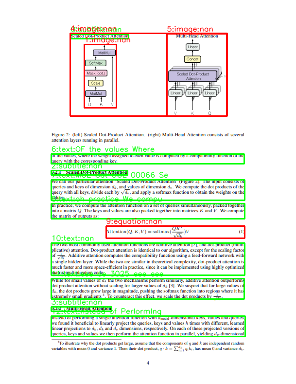

## YOLO13x_doclaynet 

  

# Solution

- If you want using my weights.pt. Please contact to us( qmdlghfl3@naver.com or qmdlghfl2@gmail.com )
- Then, we will give you our models.zip

## `<yolo-doclaynet>` Folder

1. Clone the **YOLOv13** repository and use the **ultralytics** package from it.
2. Download the **DocLayNet 30k** dataset.
3. Pre-train `yolov13x.pt` (from the YOLOv13 GitHub repository) on the DocLayNet dataset.
4. Fine-tune the model according to the slides/guidelines.
5. Place the final trained `.pt` model into the `submit_381/model` folder.

---
## User Guideline

1. Clone the **EasyOCR** repository.
2. Clone the **Yolo13v** repository and get ultralytics folder copy and paste.
3. Download the three EasyOCR pretrained weights and place them inside the `model` folder.
   - **Note:** No additional fine-tuning was performed, and the results were actually better without fine-tuning.
   - You can get here -> https://huggingface.co/felflare/EasyOCR-weights/tree/main here.
   - For using our weights, Please contact us. (qmdlghfl2@gmail.com)
4. Run `script.py`.
5. Use `평가산식코드.ipynb` (evaluation code notebook) to visualize bounding boxes.
6. After monitoring the results, execute `make_zip.ipynb` to generate the final submission zip file.

## Reference 

- YOLOv13: Real-Time Object Detection with Hypergraph-Enhanced Adaptive Visual Perception 
- https://github.com/iMoonLab/yolov13
